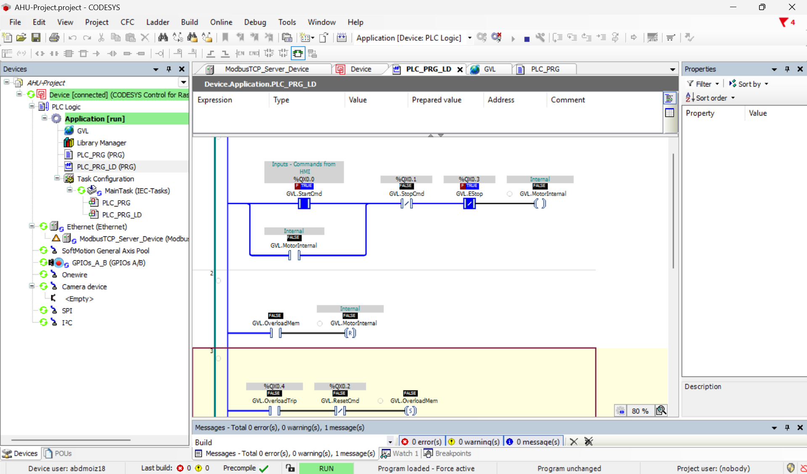
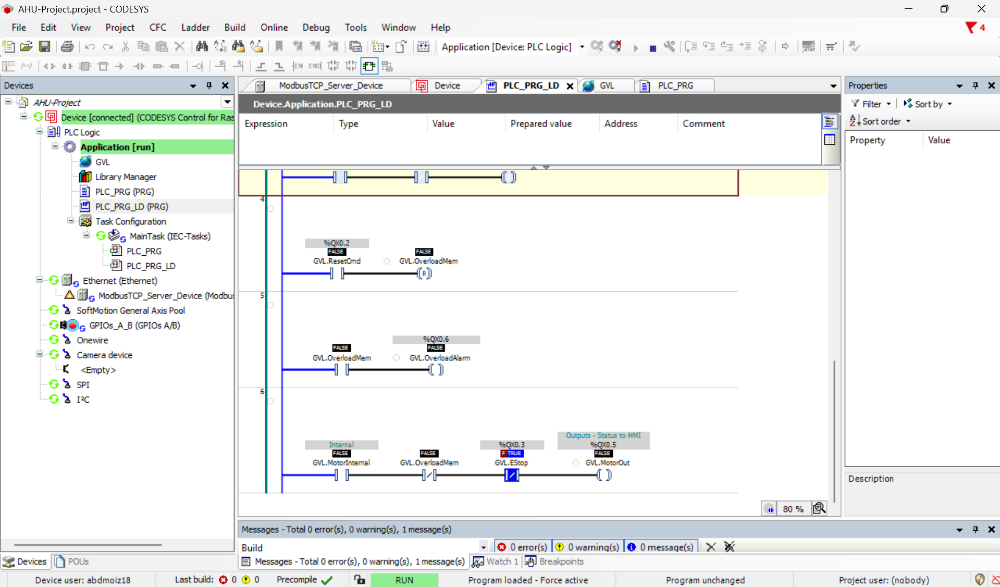
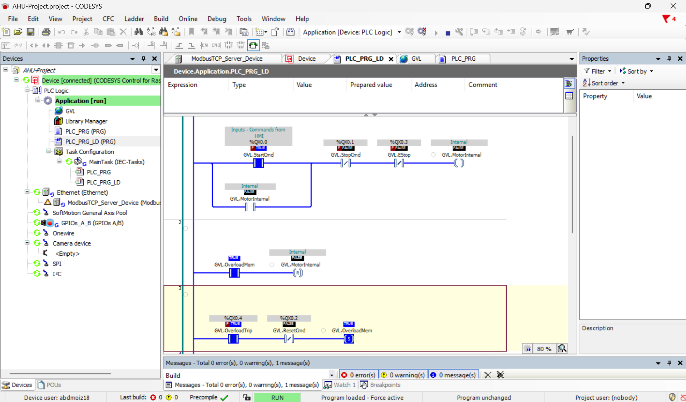
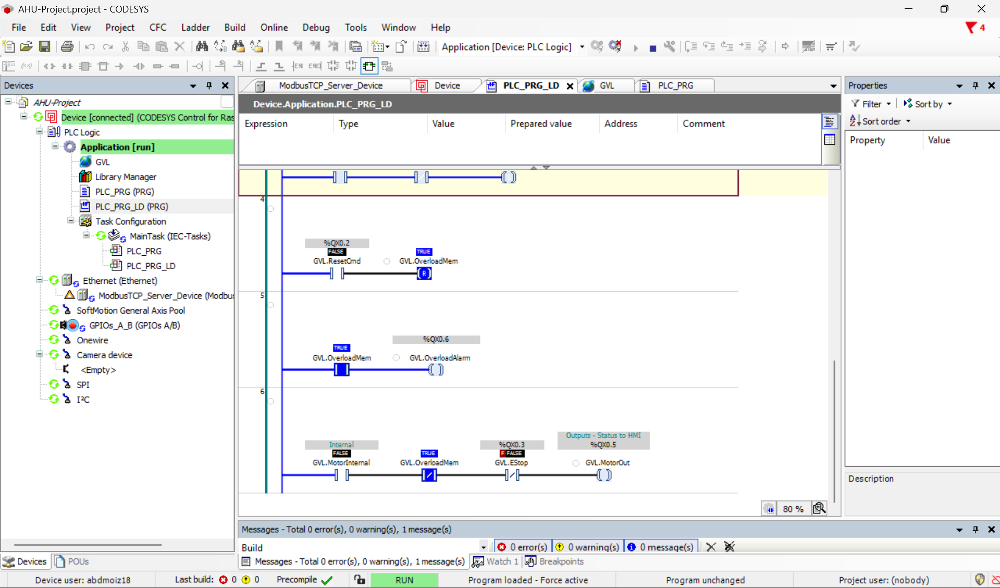

# Implementing and Testing Your Ladder Diagram in CODESYS (Raspberry Pi SL)

This guide assumes you have already built the Ladder Diagram (LD) rungs as described in the companion `README.md`. Now you will learn how to go online, force variables, verify behaviour, and troubleshoot common issues.

## Prerequisites

- CODESYS Development System (V3.5 SP19 or later)
- Raspberry Pi SL runtime (or simulation mode)
- Your LD program compiled without errors
- Network connection to the Raspberry Pi (if using real hardware)

## Step 1 – Log in to the PLC (or start simulation)

### Option A: Simulation (no hardware)
1. In the CODESYS device tree, right‑click on your device (e.g., `CODESYS Control for Raspberry Pi SL`).
2. Select **Login**.
3. A dialog asks if you want to start the simulation. Click **Yes**.
4. Click the **Start** button (green play icon) in the toolbar.

### Option B: Real Raspberry Pi SL
1. Ensure your Raspberry Pi is on the same network and the CODESYS runtime is running.
2. Right‑click the device → **Login**.
3. Download the application if prompted.
4. Click **Start**.

> **Screenshot 1:** Device tree with green “Online” indicator and the application running (play icon green).

## Step 2 – Open the Ladder Diagram editor and enable monitoring

1. Double‑click your LD POU (e.g., `PLC_PRG` or whatever you named it).
2. Ensure monitoring is on:
   - Right‑click anywhere in the editor → **Monitor** → **Start Monitoring** (or press `Ctrl+F7`).
   - Alternatively, use the online toolbar button: an eye icon or “Start Monitoring”.
3. You should now see coloured wires and contacts:
   - Blue = TRUE (energised)
   - Black/grey = FALSE

> **Screenshot 2:** LD editor with monitoring active – blue wires and contacts visible.

## Step 3 – Force variables (simulate inputs)

Forcing allows you to override inputs without physical hardware.

### How to force a variable from the LD editor

1. Right‑click on the **variable name** above a contact (e.g., `StartCmd`).
2. Navigate to **Online** → **Force Value**.
3. In the dialog, enter `TRUE` or `FALSE` and click **OK**.
4. The variable will show `(F)` next to its name, indicating it is forced.

> **Important:** Always release forces after testing: right‑click → **Online** → **Release Force**.

### Recommended watch list (GVL or separate watch)

For easier tracking, open a **Watch List**:
- View → Watch List → right‑click → **Add Variable**.
- Add: `GVL.StartCmd`, `GVL.StopCmd`, `GVL.EStop`, `GVL.OverloadTrip`, `GVL.ResetCmd`, `GVL.MotorInternal`, `GVL.OverloadMem`, `GVL.MotorOut`.

> **Screenshot 3:** Watch list showing all variables with current values.

## Step 4 – Step‑by‑step test procedure

Follow this sequence, forcing inputs and observing outputs.

### Test 1 – Start and Seal‑in
| Action | Expected Result |
|--------|----------------|
| Force `EStop = TRUE`, `StopCmd = FALSE`, `OverloadTrip = FALSE`, `ResetCmd = FALSE` | `MotorInternal = FALSE`, `MotorOut = FALSE` |
| Force `StartCmd = TRUE` for 2 seconds, then set back to `FALSE` | `MotorInternal` becomes **TRUE** and stays TRUE. `MotorOut` becomes TRUE. |

**Check in LD:** Rung 1 parallel branch holds the seal‑in (blue wires continue after `StartCmd` released).

### Test 2 – Overload Trip and Latch
| Action | Expected Result |
|--------|----------------|
| Motor running (from Test 1), force `OverloadTrip = TRUE` | `OverloadMem` becomes **TRUE** and latches. `MotorInternal` becomes FALSE. `MotorOut` becomes FALSE. |
| Release `OverloadTrip` (set to FALSE) | `OverloadMem` stays TRUE. Motor cannot start. |
| Force `StartCmd = TRUE` | Motor **does not start** (`MotorInternal` stays FALSE). |

**Check in LD:** Rung 3 Set coil `(S)` active (blue). Rung 2 Reset coil `(R)` for `MotorInternal` active. Rung 4 Reset for `OverloadMem` not active.

### Test 3 – Reset Overload and Restart
| Action | Expected Result |
|--------|----------------|
| Force `ResetCmd = TRUE` | `OverloadMem` becomes FALSE. |
| Release `ResetCmd` | `OverloadMem` stays FALSE. |
| Force `StartCmd = TRUE` (then release) | Motor runs again (`MotorInternal` = TRUE, `MotorOut` = TRUE). |

**Check in LD:** Rung 4 Reset coil `(R)` for `OverloadMem` active (blue) while `ResetCmd` forced.

## Pass/Fail Summary

| Test | Pass if… |
|------|----------|
| Start & seal‑in | `MotorInternal` stays TRUE after `StartCmd` released. |
| Overload trip | `OverloadMem` latches TRUE, motor stops, cannot restart. |
| Overload reset | `ResetCmd` clears `OverloadMem`, motor can restart. |

If all three pass, your LD is **functionally correct**.

## Troubleshooting common errors

### Error 1: The motor does not seal in (runs only while StartCmd is held)

**Possible causes:**
- Missing or incorrectly placed parallel branch for `MotorInternal` feedback.
- The feedback contact is placed **after** the stop contacts (should be before).
- You used a standard coil `( )` but forgot to insert the parallel contact.

**Fix:** Redraw Rung 1 as shown in the conversion guide. Ensure the branch starts at the same left point as the `StartCmd` contact and rejoins immediately after it.

### Error 2: Overload latch does not stay TRUE after `OverloadTrip` becomes FALSE

**Possible causes:**
- You used a standard coil `( )` instead of a Set coil `(S)` for `OverloadMem`.
- The reset rung (Rung 4) is placed **before** the set rung (Rung 3) – then reset may clear the set within the same scan.

**Fix:** Use `(S)` coil for Rung 3 and `(R)` coil for Rung 4. Place Rung 3 **above** Rung 4.

### Error 3: Motor runs even when `OverloadMem` is TRUE

**Possible causes:**
- Rung 2 (reset `MotorInternal` on overload) is missing or placed before the seal‑in rung.
- The reset coil used is a standard coil `( )` instead of `(R)` – a standard coil only writes when the rung is TRUE, but may be overwritten later.

**Fix:** Ensure Rung 2 is **after** Rung 1 and uses a Reset coil `(R)` (or Unlatch `(U)`).

### Error 4: No blue wires or contacts after going online

**Possible causes:**
- Monitoring not started.
- Application not running (paused or stopped).
- You are logged out.

**Fix:** Click **Start** (green play icon). Right‑click in LD editor → Monitor → Start Monitoring.

### Error 5: Variables do not change when forcing

**Possible causes:**
- You forced the variable but the application is not running.
- The variable is overwritten by another POU later in the scan (e.g., in a different task).
- You forced a variable that is also forced elsewhere (multiple forces).

**Fix:** Check that the application is running. Use a watch list to see final values after all rungs. Release all forces and re‑force only the input.

### Error 6: Coil fill colour is blue but variable in watch list is FALSE

**Explanation:** This happens when a later rung overwrites the variable. For example, Rung 1 sets `MotorInternal` to TRUE (coil blue), but Rung 2 resets it to FALSE in the same scan. The final value (watch list) is FALSE. This is **correct behaviour** for your overload override logic.

**Fix:** Use the watch list as the source of truth, not coil fill colour.

## Final validation checklist

- [ ] Motor starts and stays running after releasing `StartCmd`.
- [ ] Motor stops when `StopCmd` is forced TRUE.
- [ ] Motor stops when `EStop` is forced FALSE.
- [ ] When `OverloadTrip` becomes TRUE, `OverloadMem` latches TRUE and motor stops.
- [ ] Motor cannot restart while `OverloadMem` is TRUE, even if `StartCmd` is pressed.
- [ ] Pressing `ResetCmd` clears `OverloadMem`.
- [ ] Motor can restart after overload reset.

Once all tests pass, your Ladder Diagram is functionally identical to the original Structured Text.
