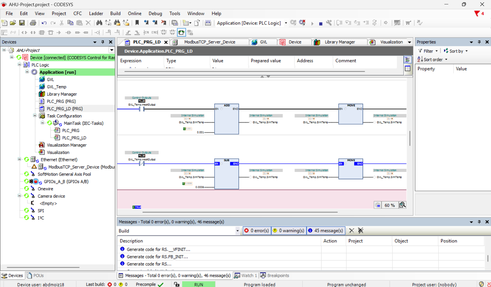
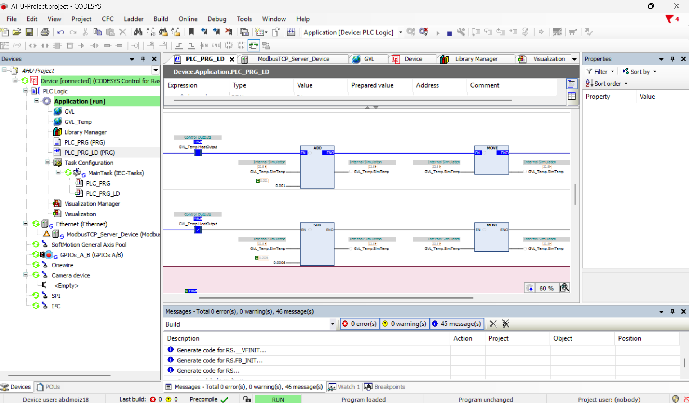
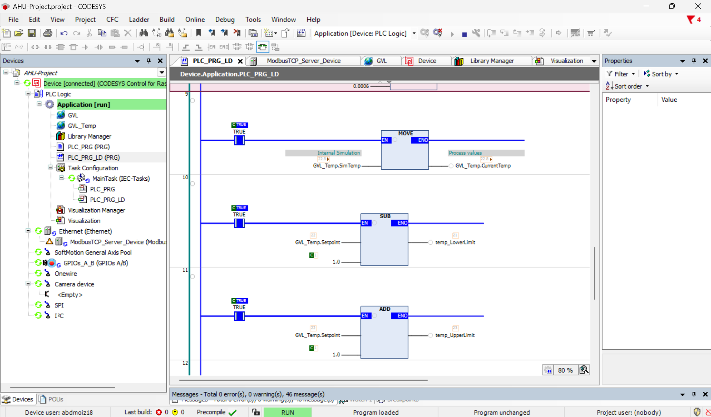
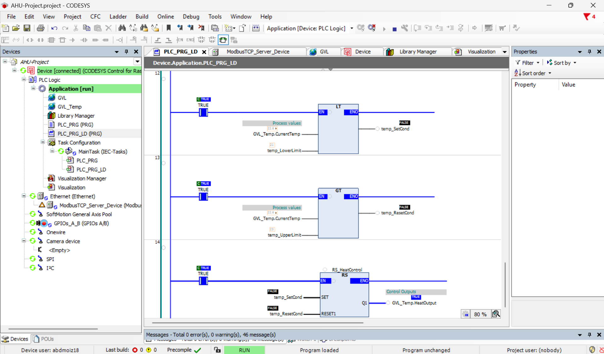

```markdown
# AHU Control Project – Motor & Temperature Logic

This project implements two independent control systems in **CODESYS V3** using **Structured Text (ST)** and **Ladder Diagram (LD)**:

- A **motor seal‑in circuit** with overload latch and emergency stop.
- A **temperature simulation** with hysteresis (on/off) control.

The repository documents the ST‑to‑LD conversion process, common pitfalls, and the final working LD implementation.

---

## Table of Contents

1. [System Overview](#system-overview)
2. [Motor Control Logic](#motor-control-logic)
   - Structured Text (original)
   - Ladder Diagram implementation
   - Truth tables
   - Errors and solutions
3. [Temperature Control Logic](#temperature-control-logic)
   - Structured Text (original)
   - Ladder Diagram implementation
   - Truth table (hysteresis)
   - Errors and solutions
4. [Screenshots](#screenshots)
5. [How to Use](#how-to-use)

---

## System Overview

**Global variables** (`GVL` and `GVL_Temp`):

| Variable          | Type   | Description                         |
|-------------------|--------|-------------------------------------|
| `StartCmd`        | BOOL   | Motor start command (momentary)     |
| `StopCmd`         | BOOL   | Motor stop command                  |
| `ResetCmd`        | BOOL   | Resets overload memory              |
| `EStop`           | BOOL   | Emergency stop (NC contact)         |
| `OverloadTrip`    | BOOL   | Thermal overload input              |
| `OverloadMem`     | BOOL   | Latched overload fault              |
| `OverloadAlarm`   | BOOL   | Alarm output                        |
| `MotorInternal`   | BOOL   | Internal seal‑in coil               |
| `MotorOut`        | BOOL   | Final motor contactor               |
| `SimTemp`         | REAL   | Simulated temperature (°C)          |
| `CurrentTemp`     | REAL   | Process value                       |
| `Setpoint`        | REAL   | Target temperature (22.0°C)         |
| `HeatOutput`      | BOOL   | Heater command                      |

---

## Motor Control Logic

### Structured Text (Original)

```pascal
(* Motor seal-in logic *)
GVL.MotorInternal := (GVL.StartCmd OR GVL.MotorInternal) AND NOT GVL.StopCmd AND NOT GVL.EStop;

(* Overload Latch - stays TRUE until reset *)
GVL.OverloadMem := (GVL.OverloadTrip OR GVL.OverloadMem) AND NOT GVL.ResetCmd;

(* Overload Alarm Output *)
GVL.OverloadAlarm := GVL.OverloadMem;

(* Motor output - runs only if internal seal-in active AND no overload AND no EStop *)
GVL.MotorOut := GVL.MotorInternal AND NOT GVL.OverloadMem AND NOT GVL.EStop;

(* If overload trips, break the seal-in *)
IF GVL.OverloadMem THEN
    GVL.MotorInternal := FALSE;
END_IF
```

### Ladder Diagram Implementation

**Rung 1 – Overload Latch & Alarm**  
`(OverloadTrip OR OverloadMem) AND NOT ResetCmd`

```
   GVL.OverloadTrip         GVL.ResetCmd
-------| |--------+-----------|/|--------+-------( )-------
                  |                       |      GVL.OverloadMem
                  +-------| |-------------+
                          GVL.OverloadMem

   GVL.OverloadMem
-------| |---------------------------------------( )-------
                                                GVL.OverloadAlarm
```

**Rung 2 – Motor Seal‑in**  
`(StartCmd OR MotorInternal) AND NOT StopCmd AND NOT EStop AND NOT OverloadMem`

```
   GVL.StartCmd          GVL.StopCmd   GVL.EStop   GVL.OverloadMem    GVL.MotorInternal
----| |----+-------------|/|------------|/|----------|/|----------------( )---
           |
           | GVL.MotorInternal
           +----| |-------+
```

**Rung 3 – Motor Output**  
`MotorInternal AND NOT OverloadMem AND NOT EStop`

```
   GVL.MotorInternal   GVL.OverloadMem   GVL.EStop
-------| |----------------|/|--------------|/|--------+-------( )-------
                                                      GVL.MotorOut
```

### Truth Tables

#### Seal‑in behaviour (steady state)

| StartCmd | MotorInternal (previous) | StopCmd | EStop | OverloadMem | MotorInternal (new) |
|----------|--------------------------|---------|-------|-------------|---------------------|
| 0        | 0                        | 0       | 0     | 0           | 0                   |
| 1        | X                        | 0       | 0     | 0           | 1                   |
| 0        | 1                        | 0       | 0     | 0           | 1 (sealed)          |
| X        | X                        | 1       | 0     | 0           | 0                   |
| X        | X                        | 0       | 1     | 0           | 0                   |
| X        | X                        | 0       | 0     | 1           | 0                   |

#### Overload Latch (Reset‑dominant)

| OverloadTrip | OverloadMem (previous) | ResetCmd | OverloadMem (new) |
|--------------|------------------------|----------|-------------------|
| 1            | X                      | 0        | 1                 |
| 0            | 1                      | 0        | 1 (latched)       |
| X            | X                      | 1        | 0                 |
| 0            | 0                      | 0        | 0                 |

### Errors Encountered & Solutions (Motor Part)

| Error Code | Message | Cause | Solution |
|------------|---------|-------|----------|
| `C0373`    | Expression has no effect | In LD, a parallel branch with `MotorInternal` rejoined after the NC contacts, making it ineffective. | Rejoin the branch **immediately after** `StartCmd` (before any permissive). |
| (no error) | Can't place parallel contacts at the left rail | CODESYS LD does not allow a parallel branch starting directly on the left power rail. | Use a single `StartCmd` contact, then insert a parallel branch with `MotorInternal` **after** it. |

---

## Temperature Control Logic

### Structured Text (Original)

```pascal
(* PLC Cycle is approximately 10 ms *)
IF GVL_Temp.HeatOutput THEN
    GVL_Temp.SimTemp := GVL_Temp.SimTemp + 0.001;
ELSE
    GVL_Temp.SimTemp := GVL_Temp.SimTemp - 0.0006;
END_IF

GVL_Temp.CurrentTemp := GVL_Temp.SimTemp;

(* Hysteresis on/off Control – deadband ±1.0°C *)
IF GVL_Temp.CurrentTemp < (GVL_Temp.Setpoint - 1.0) THEN
    GVL_Temp.HeatOutput := TRUE;
ELSIF GVL_Temp.CurrentTemp > (GVL_Temp.Setpoint + 1.0) THEN
    GVL_Temp.HeatOutput := FALSE;
END_IF
```

### Ladder Diagram Implementation

**Rung 7 – Heating branch (HeatOutput = TRUE)**  
Add 0.001 to `SimTemp`.

```
   GVL_Temp.HeatOutput                                 ADD
-------| |---------------------------------------------|EN|
                                                       |   |
                                                 SimTemp--|IN1|
                                                 0.001--|IN2|
                                                       |   |
                                                       |Q|--+---[MOVE]--- SimTemp
                                                           |   |IN|
                                                           +---|   |
```

**Rung 8 – Cooling branch (HeatOutput = FALSE)**  
Subtract 0.0006 from `SimTemp`.

```
   GVL_Temp.HeatOutput                                 SUB
-------|/|---------------------------------------------|EN|
                                                       |   |
                                                 SimTemp--|IN1|
                                                 0.0006-|IN2|
                                                       |   |
                                                       |Q|--+---[MOVE]--- SimTemp
                                                           |   |IN|
                                                           +---|   |
```

**Rung 10 – Copy `SimTemp` to `CurrentTemp`**  

```
   TRUE                                            MOVE
----| |---------------------------------------------|EN|
                                                   |   |
                                             SimTemp--|IN|   CurrentTemp
                                                   |   |----|Q|---
```

**Rungs 11–14 – Hysteresis with RS flip‑flop**

Rung 11 – Compute lower threshold: `Setpoint - 1.0`  
Rung 12 – Compute upper threshold: `Setpoint + 1.0`  
Rung 13 – Compare `CurrentTemp` with thresholds (LT and GT)  
Rung 14 – RS flip‑flop (instance `RS_Heat`) sets/resets `HeatOutput`

```
   TRUE                                            SUB
----| |---------------------------------------------|EN|
                                                   |   |
                                             Setpoint--|IN1|
                                             1.0-----|IN2|
                                                   |   |
                                                   |Q|-------+  LowerLimit

   TRUE                                            ADD
----| |---------------------------------------------|EN|
                                                   |   |
                                             Setpoint--|IN1|
                                             1.0-----|IN2|
                                                   |   |
                                                   |Q|-------+  UpperLimit

   GVL_Temp.CurrentTemp    LowerLimit              LT
-------| |-------------------+---| |---------------+---|EN|
                           |   |   |               |   |
                           |   |   |               |Q|-------+  SetCond
   GVL_Temp.CurrentTemp    UpperLimit              GT
-------| |-------------------+---| |---------------+---|EN|
                           |   |   |               |   |
                           |   |   |               |Q|-------+  ResetCond

   SetCond  RS_Heat : RS
-------| |-----------|S1 Q1|------- GVL_Temp.HeatOutput
   ResetCond         |R   |
-------| |-----------|    |
```

### Truth Table (Hysteresis)

| Condition                                   | SetCond (LT) | ResetCond (GT) | HeatOutput (new) |
|---------------------------------------------|--------------|----------------|------------------|
| `CurrentTemp < Setpoint - 1.0` (e.g., 20.9°C) | TRUE         | FALSE          | **TRUE** (heating ON) |
| `Setpoint - 1.0 ≤ CurrentTemp ≤ Setpoint + 1.0` | FALSE        | FALSE          | **Hold** previous state |
| `CurrentTemp > Setpoint + 1.0` (e.g., 23.1°C) | FALSE        | TRUE           | **FALSE** (heating OFF) |

### Errors Encountered & Solutions (Temperature Part)

| Error Code | Message | Cause | Solution |
|------------|---------|-------|----------|
| `C0007`, `C0009`, `C0035` | Expression expected, Unexpected '?', Program name expected | RS block placed without an **instance name**. | Double‑click the block header and type an instance name, e.g., `RS_Heat`. |
| `C0080` | Function block 'RS' must be instantiated | Same as above – missing instance name. | Add instance name. Also ensure `Standard` library is added to the project. |
| (no error) | Rungs 7 & 8 change colour frequently while others are static | Normal behaviour: simulation runs each cycle; motor logic only changes on operator input. | No action needed. |

---

## Screenshots

### Rung 7 TRUE & Rung 8 FALSE (heating active)



*When `HeatOutput` is TRUE, the heating branch (ADD) executes; the cooling branch (SUB) is disabled because its contact is NC and `HeatOutput` is TRUE.*

### Rung 7 FALSE & Rung 8 TRUE (cooling active)



When `HeatOutput` is FALSE, the heating branch is disabled; the cooling branch executes (subtracts 0.0006).

### Rungs 9, 10 & 11



Rung 10 copies `SimTemp` to `CurrentTemp`. Rung 11 calculates the lower threshold (`Setpoint - 1.0`).

### Rungs 12, 13 & 14



Rung 12 calculates the upper threshold (`Setpoint + 1.0`). Rung 13 performs the LT and GT comparisons. Rung 14 is the RS flip‑flop that sets/resets `HeatOutput`.

---

## How to Use

1. Open the project in **CODESYS V3.5 SP18** or newer.

2. Ensure the **`Standard` library** is added (needed for `RS` flip‑flop).

3. Build the application – no errors should remain.

4. Log in to the PLC (or simulation) and start the task.

5. Monitor variables:

   - Toggle `StartCmd` to run the motor; `StopCmd`, `EStop`, or `OverloadTrip` will stop it.
   
   - Observe `CurrentTemp` slowly oscillating around `22.0°C` while `HeatOutput` toggles.

To adjust the simulation speed, change the deltas in Rungs 7 and 8 (currently `0.001` and `0.0006`) according to your cycle time.
